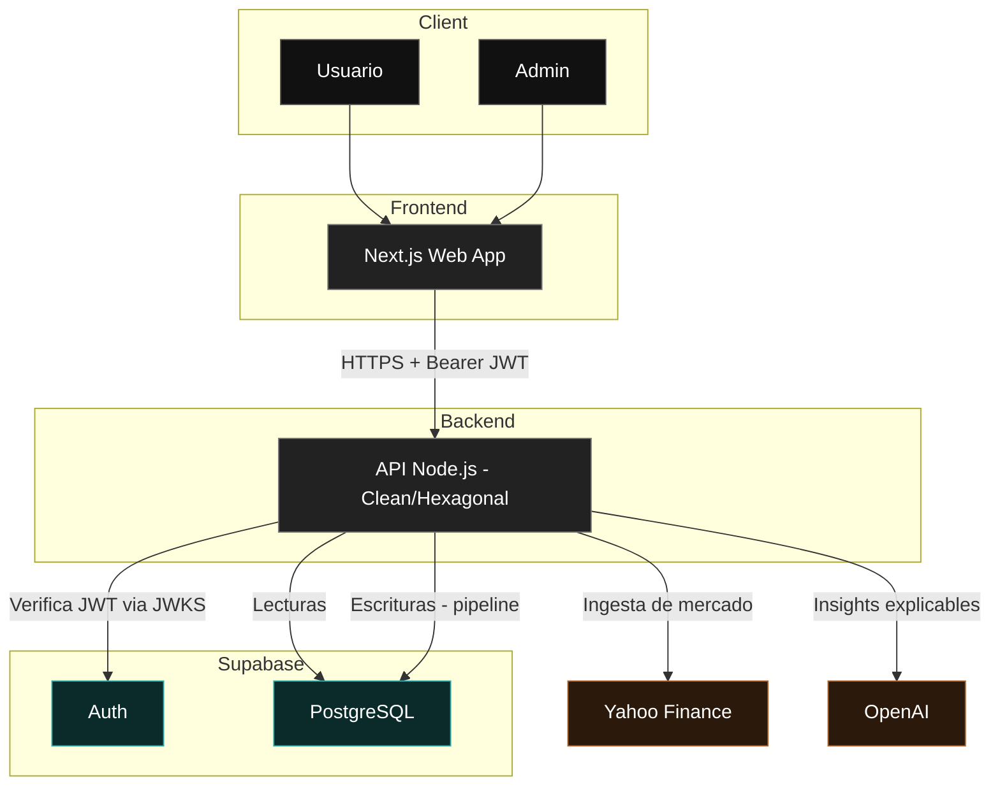

# InversorAI

**InversorAI** es una plataforma full-stack de análisis de mercados financieros que combina **datos de mercado reales** (Crypto, Acciones y FX) con **análisis cuantitativo** e **inteligencia artificial** para generar **insights y recomendaciones de inversión explicables**.

El sistema está diseñado y construido siguiendo principios de **Clean Architecture**, **TDD** y **separación estricta de responsabilidades**, con un enfoque claro en **calidad académica, robustez técnica y experiencia de usuario profesional**.

Este proyecto corresponde al **Trabajo Final de Máster (TFM)** del Máster en Desarrollo con Inteligencia Artificial.

---

## Objetivos del Proyecto

- Analizar activos financieros reales (CRYPTO, STOCK y FX).
- Automatizar la ingesta de datos de mercado directamente desde Internet.
- Calcular indicadores técnicos y métricas cuantitativas.
- Generar análisis e insights mediante IA explicable.
- Ofrecer recomendaciones de inversión claras y defendibles.
- Proveer una interfaz web profesional con UX de nivel producto.
- Demostrar buenas prácticas de arquitectura, testing y seguridad.

---

## Activos Soportados (MVP)

El MVP soporta múltiples mercados reales:

| Tipo   | Símbolo   | Descripción        |
|--------|-----------|--------------------|
| Crypto | BTC-USD   | Bitcoin            |
| Stock  | AAPL      | Apple Inc.         |
| FX     | EURUSD=X  | Euro / Dólar USD   |

Todos los precios e históricos provienen de **Yahoo Finance** y son **verificables externamente**.

---

## Arquitectura

### Diagrama de alto nivel (C4-lite)



**Regla clave:** los providers externos (Yahoo/OpenAI) se usan **solo para ingesta/generación y escritura**; la UI siempre lee desde **PostgreSQL** como fuente de verdad.

El sistema sigue una **Clean / Hexagonal Architecture**, separando claramente:

- **Dominio**: entidades, reglas de negocio y casos de uso.
- **Aplicación**: orquestación de procesos.
- **Infraestructura**: proveedores externos (market data, IA, persistencia).
- **Interfaces**: API REST y frontend web.

### Principios clave

- Los providers se utilizan exclusivamente para **ingesta y escritura**.
- Todas las lecturas se realizan desde una **fuente de verdad persistida**.
- Los fake providers existen **solo para testing**.
- El código está preparado para evolucionar sin acoplamientos.

---

## Inteligencia Artificial

El sistema utiliza IA para:

- Analizar tendencias de mercado.
- Explicar oportunidades de inversión.
- Generar recomendaciones estructuradas (BUY / HOLD / SELL).

### Características

- Output validado por esquema Zod (`services/api/src/application/schemas/`).
- Versionado de prompts (`prompt_version` en cada insight).
- Insights explicables (no caja negra).
- Sanitización de inputs LLM para prevenir prompt injection (`services/api/src/infrastructure/ai/OpenAIProvider.ts`).
- IA integrada como parte del sistema, no como feature aislado.

---

## Seguridad

### Autenticación

- **Supabase Auth** (email + password).
- Verificación de JWT **local via JWKS** usando la librería `jose` (`services/api/src/infrastructure/auth/verifySupabaseJwt.ts`).
- El backend obtiene las claves públicas de `{SUPABASE_URL}/auth/v1/.well-known/jwks.json`.

### Autorización (RBAC)

- Roles: **USER** (lectura) y **ADMIN** (lectura + pipeline + gestión de usuarios).
- El rol se deriva de `app_metadata.inversorai_role` en el JWT (default: USER).
- Middleware `requireAdmin` protege endpoints administrativos (`services/api/src/interfaces/http/middlewares/requireAdmin.ts`).

### Step-up Auth

- Cambios de rol requieren **autenticación reciente** (token emitido hace menos de N segundos).
- Si el token no es reciente, responde `401` con `code: REAUTH_REQUIRED`.
- Configurable via `ADMIN_STEP_UP_MAX_AGE_SECONDS` (default: 300s).
- Implementado en `services/api/src/interfaces/http/middlewares/requireRecentAuth.ts`.

### Controles de Seguridad Adicionales

| Control | Implementación | Archivo |
|---------|----------------|---------|
| Helmet headers | CSP, X-Frame-Options, etc. | `app.ts` |
| CORS allowlist | Via `CORS_ORIGINS` env var | `services/api/src/config/cors.ts` |
| Request body limit | 1MB máximo | `app.ts` (`express.json({ limit: '1mb' })`) |
| Rate limiting | Por usuario+asset en pipeline | `services/api/src/interfaces/http/middlewares/rateLimiter.ts` |
| Rate limit distribuido | Opcional via Supabase Postgres | `docs/db/001_rate_limit_function.sql` |
| Guardrails de producción | Fake providers bloqueados en prod | `services/api/src/interfaces/http/server.ts` |
| Request ID tracking | UUID por request, header `X-Request-Id` | `services/api/src/interfaces/http/middlewares/requestId.ts` |
| Error handler centralizado | Logs estructurados, response sanitizado | `services/api/src/interfaces/http/middlewares/errorHandler.ts` |

### Gobernanza de Admins

- Bootstrap del primer ADMIN via script idempotente: `npm run bootstrap:admin`.
- Protección contra demover al último ADMIN (`services/api/src/application/use-cases/SetUserRole.ts`).
- Audit logging de acciones administrativas (`services/api/src/interfaces/http/audit/`).
- Persistencia opcional de audit logs en Supabase (`AUDIT_LOG_PERSIST=true`).

---

## Testing y Calidad

### Estrategia

- **TDD** como metodología de desarrollo.
- Tests unitarios para dominio y casos de uso.
- Tests de integración **opt-in** (requieren secrets).

### Comandos

```bash
# Backend
cd services/api
npm test              # Unit tests
npm run test:coverage # Con cobertura

# Frontend
cd apps/web
npm test              # Unit tests
npm run build         # Type-check + build
```

### CI-lite Policy

El CI ejecuta **solo tests unitarios** sin secrets externos:

- Tests de integración usan `describe.skip` cuando faltan env vars.
- Esto permite CI verde sin exponer credenciales.
- Tests de integración completos se ejecutan **localmente** con `.env` configurado.

Ver: `.github/workflows/ci.yml` y `docs/07_TESTING_Y_CALIDAD.md`.

### Tests de Seguridad

- Verificación JWKS mock (`services/api/src/__tests__/`)
- RBAC (USER vs ADMIN)
- Step-up auth
- Guardrails de producción
- Headers de seguridad (Helmet)
- Body size limit
- CORS

---

## CI/CD

### GitHub Actions (`.github/workflows/ci.yml`)

| Step | Descripción |
|------|-------------|
| `npm ci` | Instalación de dependencias |
| `npm audit --omit=dev --audit-level=high` | Auditoría de seguridad |
| `npm run test:coverage` | Tests backend + cobertura |
| `npm run build` (backend) | Compilación TypeScript |
| `npm test` (frontend) | Tests frontend |
| `npm run build` (frontend) | Build Next.js |
| Upload artifact | `coverage/lcov.info` |

### Dependabot

Configurado para actualizaciones automáticas de npm y GitHub Actions (`.github/dependabot.yml`).

---

## Stack Tecnológico

### Backend

- Node.js + TypeScript
- Express 5 + Clean Architecture
- Supabase (PostgreSQL + Auth)
- Yahoo Finance (market data)
- OpenAI (IA)
- Vitest (testing)
- Zod (validación)

### Frontend

- Next.js 14+ (App Router)
- TailwindCSS + shadcn/ui
- Recharts (visualización)
- Light / Dark mode
- React Testing Library + Vitest

### Infraestructura

- Monorepo (npm workspaces)
- Separación backend / frontend
- Preparado para despliegue en producción

---

## Ejecución en Local

### Requisitos

- Node.js 20+
- Cuenta en Supabase
- Variables de entorno configuradas (ver `.env.example`)

### Backend

```bash
cd services/api
npm install
node dist/interfaces/http/server.js  # Después de npm run build
```

### Frontend

```bash
cd apps/web
npm install
npm run dev
```

Acceder a: http://localhost:3000

---

## Variables de Entorno

Ver `.env.example` para la lista completa. Variables clave:

```env
# Supabase
SUPABASE_URL=https://your-project.supabase.co
SUPABASE_SERVICE_ROLE_KEY=...  # Solo backend

# Frontend (públicas)
NEXT_PUBLIC_SUPABASE_URL=...
NEXT_PUBLIC_SUPABASE_ANON_KEY=...

# Seguridad
CORS_ORIGINS=https://app.inversorai.com
NODE_ENV=production
MARKET_DATA_PROVIDER=REAL  # Requerido en producción

# Opcional
RATE_LIMIT_STORE=supabase  # Para rate limiting distribuido
AUDIT_LOG_PERSIST=true     # Para persistir audit logs
```

---

## Documentación Adicional

| Documento | Descripción |
|-----------|-------------|
| `docs/00_INDICE.md` | Índice de documentación |
| `docs/07_TESTING_Y_CALIDAD.md` | Estrategia de testing |
| `docs/08_CICD_Y_DEPLOY.md` | CI/CD y despliegue |
| `docs/09_CHECKLIST_FINAL_TFM.md` | Checklist de entrega |
| `docs/SUPABASE_CONFIG.md` | Configuración de Supabase |
| `docs/AUDIT_LOGGING.md` | Audit logging y GDPR |

---

## Flujo de Demo Recomendado (Defensa)

1. Registro de usuario (USER).
2. Login y acceso al dashboard (`/dashboard`).
3. Visualización de datos reales (verificables en Google Finance).
4. Cambio de activos (Crypto / Stock / FX).
5. Visualización de indicadores y gráficos.
6. Login como ADMIN → Acceso a `/dashboard/admin`.
7. Ejecución del pipeline de análisis.
8. Generación de insight IA y recomendación.
9. Demo de cambio de rol (requiere re-autenticación).
10. Demo de reset de password.

---

## Fuente de Datos y Disclaimer

- Fuente de datos de mercado: **Yahoo Finance**.
- Los análisis e insights generados **no constituyen asesoramiento financiero**.
- El sistema tiene fines educativos y demostrativos.

---

## Estado del Proyecto

- MVP completo y funcional.
- Desplegado en producción.
- Preparado para evaluación académica.
- Base sólida para evolución futura.

---

## Autor

Trabajo realizado como **Trabajo Final de Máster (TFM)**
Máster en Desarrollo con Inteligencia Artificial.
